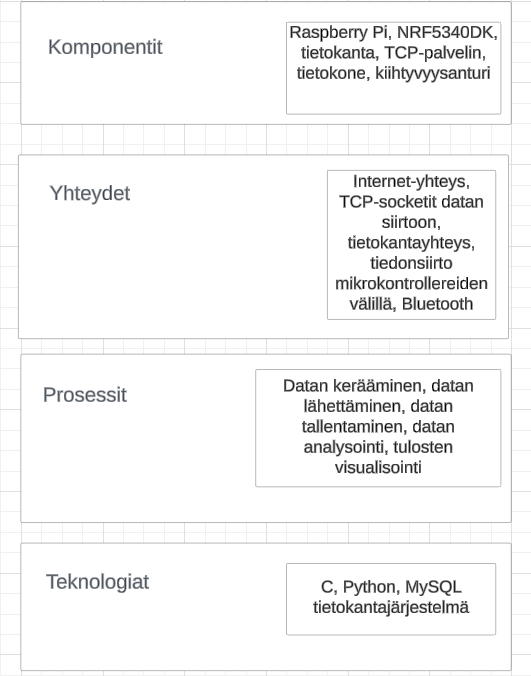
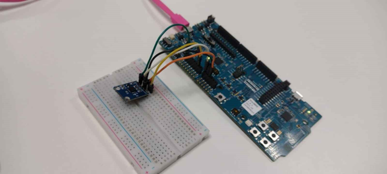
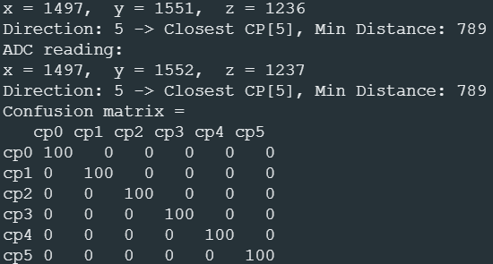

# Tietoliikenteen sovellusprojektin esittelyteksti

## Tarkoitus ja kuvaus

Projektin perimmäisenä tarkoituksena oli oppia lisää Linux-palvelimista, Bluetoothista, tietokantojen muokkaamisesta, Python-neuroverkoista ja mikrokontrollereista. Projektissa käytettiin NRF5340DK-mikrokontrolleria, joka oli kytketty kiinni kiihtyvyysanturiin. Kiihtyvyysanturi mittaa kiihtyvyyttä x-, y- ja z-akseleiden suunnassa ja palauttaa näiden kiihtyvyysarvot kokonaislukuina. NRF5340DK-mikrokontrolleriin ohjelmoitiin ensin C-kielinen sovellus, joka lähetti nämä arvot puhelimessa olevaan nRF Connect-sovellukseen NOTIFY-signaaleina. Tämän jälkeen teimme Python-ohjelman, joka lähetti kiihtyvyysanturin arvot Linux-palvelimella sijaitsevaan MySQL-tietokantaan. Python-ohjelma ajettiin Raspberry Pi-mikrokontrollerin sisällä, eli tieto kulkee mikrokontrollereiden välillä ja sitten päätyy Linux-palvelimella sijaitsevaan tietokantaan.

Lisäksi teimme PHP-skriptin, joka näyttää ryhmämme lähettämän datan tietokannassa web-selaimen kautta, sekä TCP-asiakasohjelman Pythonilla, joka tallentaa tietokannan dataa omalle koneelle CVS-tiedostona. Olemme myös laatineet Python-skriptin, joka hakee datan suoraan tietokannasta MySQL-rajapinnan avulla.

Projektin hallintaan käytimme GitHubissa sijaitsevaa Kanban-taulua. Lisäksi olimme kirjoittaneet lyhyen kuvauksen projektista Markdown-kielellä ja laatineet projektista arkkitehtuurikaavion.

## Työskentelymenetelmät

Projektiin sisältyi myös liiketoimintaosaamisen ja viestinnän opiskelua. Projektin aikana laadimme aina maanantaisin liiketoimintasuunnitelmaa kuvitteelliselle yritykselle, sekä opiskelimme viestinnän suunnittelua, taitoja ja tapoja. Tiistaina, keskiviikkona ja torstaina toteutimme projektiin kuuluvia ja liittyviä ohjelmointitehtäviä. Keskiviikkoisin ja torstaisin teimme tilannepäivitykset projektin Discord-kanavalle, ja perjantaisin osallistuimme Scrum-kokoukseen, jossa käytiin läpi kyseisellä viikolla suoritettavat työtehtävät.

## Viikoittainen eteneminen

### Ensimmäinen viikko

Projekti käynnistettiin luomalla GitHub-repositorio, arkkitehtuurikaavio ja alustamalla Kanban-taulu projektinhallintaa varten. Raspberry Pi -laitteen käyttöönotto suoritettiin onnistuneesti ilman merkittäviä ongelmia. Lisäksi Linux-palvelin asennettiin ja otettiin käyttöön molempien ryhmän jäsenten työympäristöihin.

### Toinen viikko

Toisella viikolla projekti eteni siihen vaiheeseen, että kiihtyvyysanturi konfiguroitiin lähettämään XYZ-dataa kehitysalustan Bluetooth-toiminnallisuuden avulla älypuhelimeen ladattuun nRF Connect-sovellukseen. Lisäksi ryhmän jäsenet suorittivat Nordic Academyn Bluetooth Low Energy Fundamentals -kurssin ja saivat siitä todistuksen.

### Kolmas viikko

Kolmannella viikolla luotiin uusi Git-haara nimeltä linux-kokeilut, johon tallennettiin kaikki testaukseen ja kokeiluun liittyvät muutokset. Repositorio pidettiin ajan tasalla GitHubissa säännöllisten commit-päivitysten avulla. Omalle Linux-palvelimelle asennettiin ja otettiin käyttöön Netfilter-palomuurisovellus esimerkkiskriptin avulla. Palomuurin toimivuutta testattiin avaamalla TCP-portit 80 ja 22 sekä määrittämällä takaoveksi osoite 193.167.100.97 (students.oamk.fi). Lisäksi ICMP-liikenteen sallimista ja estämistä testattiin pingaamalla palvelinta. Toimiva palomuuriskripti tallennettiin GitHub-repositorioon tulevaa käyttöä varten.

Raspberry Pi -laitteelle luotiin Python-ohjelma nano-tekstieditorilla. Ohjelma vastaanottaa dataa kehitysalustalta Bluetoothin välityksellä, hyödyntäen Bleak-kirjastoa. Vastaanotettu data lähetettiin MySQL-tietokantaan, joka oli valmiiksi määritelty 172.20.241.9-palvelimella.

Linux-palvelimelle asennettiin Apache-verkkopalvelin ja PHP-tuki pikaohjeiden mukaisesti. PHP-skripti kirjoitettiin palvelimen var/www/html-hakemistoon, ja sen toimivuutta testattiin selaimen avulla. Lisäksi luotiin PHP-ohjelma, joka noutaa ja näyttää tietoja tietoliikennelaboratorion MySQL-tietokannasta. Tiedonsiirron liikenne kaapattiin tcpdump-työkalulla, ja kaappaustiedosto analysoitiin Wireshark-ohjelmalla, jossa tutkittiin mm. TCP-kättelyn kestoa ja HTTP-otsaketietoja.

Pythonilla toteutettiin TCP-asiakasohjelma, joka nouti tietokannasta tietoa HTTP-rajapinnan kautta ja tallensi sen CSV-muotoon. Toinen Python-ohjelma kehitettiin hakemaan tietoja suoraan MySQL-tietokannan rajapinnan kautta. Tietokantatunnukset tallennettiin ympäristömuuttujana tai erilliseen tiedostoon, joka lisättiin .gitignore-tiedostoon tietoturvan varmistamiseksi.

Linux-palvelimelle määritettiin salasanaton SSH-kirjautuminen ed25519-avaimella. Avainten generointi suoritettiin komentorivillä, ja avaimen toimivuus testattiin onnistuneella kirjautumisella. Tämä varmisti turvallisen ja sujuvan pääsyn palvelimelle ilman salasanoja.

### Neljäs viikko

Visual Studio Codeen asennettiin Thunder Client -lisäosa REST-apien testaamiseen. Ilmatieteen laitoksen rajapinnasta haettiin Oulun säätiedot, ja HTTP GET -kyselyjen toimivuutta testattiin sisältäen tarkistuksia, kuten vastauksen JSON-muotoisuus ja tiettyjen merkkijonojen esiintyminen. Linux-palvelimelle Apache-konfiguraatioon lisättiin ErrorDocument-sääntö, joka palauttaa satunnaisen kissakuvan Cataas-rajapinnasta, kun tiedostoa ei löydy. Loimme Pythonilla TCP-asiakasohjelman, joka hakee tietokannasta maksimissaan 300 riviä dataa tietoliikennelaboratorion palvelimelta portista 20000. Ohjelma tallensi datan tiedostoon jatkokäsittelyä varten.

### Viides viikko

Luotiin neuroverkkoluokittelija, joka ottaa inputtina kolme arvoa: x, y, z. Neuroverkko suunniteltiin luokittelemaan syöte kuuteen eri luokkaan. Neuroverkon pohjana käytettiin Kerasin tarjoamaa esimerkkiä MNIST-konvoluutiomallista. Verkkoa muokattiin siten, että se tukee projektin vaatimaa kolmen inputin syötettä ja kuuden luokan outputtia. Neuroverkko koulutettiin omalla datasetillä, jossa jokaiselle (x, y, z) -syötteelle oli määritelty yksi kuudesta luokasta (suunta). Datan käsittelyssä varmistettiin oikea normalisointi ja valmistelu ennen mallin koulutusta. Koulutuksessa käytettiin optimoijana Adamia ja kategorista ristientropiaa menetysten laskemiseen. Koulutuksen tuloksena saatiin toimiva malli, joka ylsi >70 % tarkkuuteen validointidatalla.

Seuraavaksi toteutettiin Python-koodi, joka pystyy laskemaan neuroverkon tuloksen annetulla parametreilla ja syötteillä. Koodi hyödyntää opitun neuroverkon weight- ja bias-parametreja hidden- ja output-layerien osalta. Lopputulosta verrattiin koulutetun neuroverkon model.predict-funktiolla laskemaan tulokseen Google Colab -ympäristössä. Näiden vastaavuus todisti laskennan toimivuuden. Koulutetun neuroverkon paino- ja bias-matriisit tallennettiin neuroverkonKertoimet.h-tiedostoon.

### Kuudes viikko

Toteutimme K-means-algoritmin nRF5340DK-alustalle. Mittasimme kiihtyvyysanturilla x-, y- ja z-kiihtyvyysarvot ja laskimme 3D-pisteen etäisyyden kaikkiin kuuteen keskipisteeseen, jotka oli opetettu edellisellä viikolla Pythonilla. Toteutimme confusion.c-tiedostoon puuttuvat aliohjelmat ja suoritimme mittaukset omalla laitteella ja kiihtyvyysanturilla. Tuloksena saatiin confusion matrix, joka kuvasi K-means-luokittelualgoritmin toimintaa ja tarkkuutta. Lisäsimme confusion matrix -kuvan omaan GitHub-repositorioon README-tiedostoon.

Viikon ylimääräinen tavoite oli toteuttaa Colabissa opettamamme neuroverkko nRF5340DK-alustalle ja arvioida algoritmin suorituskykyä laskemalla ja tulostamalla confusion matrixin.

### Seitsemäs viikko ja kurssin lopetus

Seitsemännellä viikolla projektissa viimeisteltiin projektista kertova posteri, muokattiin GitHub-repositorioita ja niiden kuvauksia sekä viimeisteltiin Kanban-taulu. Tiistaina 17.12.2025 pidettiin projektin loppuyhteenveto, jolloin palautettiin projektissa käytetyt lainatut komponentit, käytiin posterit läpi ja muutamat valitut ryhmät esittelivät tuotoksiaan.

Projektista jäi mieleen Linux-palvelimien kätevyys ja neuroverkkoluokittelijan käsin toteuttamisen vaikeus, koska emme käyttäneet valmiita kirjastoja. Aluksi, kun teimme mittauksia kiihtyvyysanturilla, suuntatietoihin tuli virheellistä dataa. Tämän takia mittaukset piti tehdä uudelleen paremmalla logiikalla. Mittauksia ei enää tehty, kun suuntaa vaihdettiin. Myös neuroverkkoluokittelijan kerroksia piti muuttaa yksinkertaisemmiksi, kun aloimme muokkaamaan Python-koodia C-kielelle.
