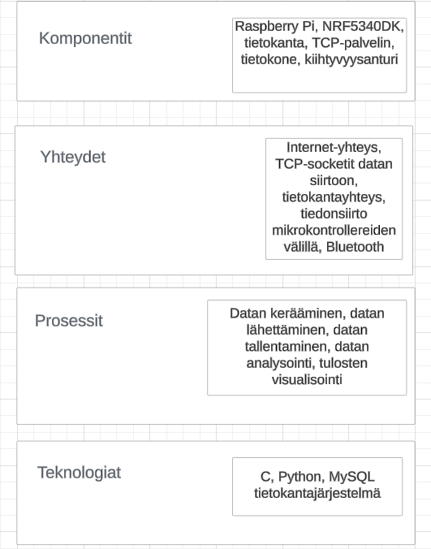

# Tietoliikenteen_sovellusprojekti2024

## Tehtävän kuvaus

Projektin tehtävänä on suunnitella **Thingy**-laitteelle client-sovellus, joka suorittaa seuraavat toiminnot:

1. **Anturidatan keruu**: Thingy mittaa anturidataa, kuten kiihtyvyysanturilta.
2. **Langaton tiedonsiirto**: Kerätty anturidata lähetetään langattomasti IoT-reitittimelle (esim. Raspberry Pi).

### Datan siirto ja tallennus

- **Raspberry Pi** toimii IoT-reitittimenä ja välittää Thingyltä saadun datan eteenpäin Oamkin MySQL-palvelimelle.
- **Tietokantaan tallentuvaan dataan** on pääsy kahdella rajapinnalla:
  - **TCP-sokettirajapinta**
  - **Yksinkertainen HTTP API**

### Datan käsittely

- Kerättyä dataa haetaan **HTTP-rajapinnan** kautta opiskelijoiden kannettavalle tietokoneelle koodatulla ohjelmalla.
- Haettua dataa käsitellään **koneoppimisen** tarpeisiin, esimerkiksi käyttäen **keskipistealgoritmi**a (K-means) ja **confusion matrix** -työkalua analyysin tarkkuuden arviointiin.

### Työvaiheet

1. Kiihtyvyysanturimittaukset Thingyllä (C & NRF5340DK).
2. Kiihtyvyysanturidatan siirto tietokantaan käyttäen C- ja Python-kieltä.
3. TCP-client, joka lukee tietokannasta dataa (Python).
4. K-means-opetusalgoritmin soveltaminen ja opetusvaihe (Python).
5. K-means-mittaukset ja **confusion matrix** -analyysi Thingyllä (C & NRF5340DK).
